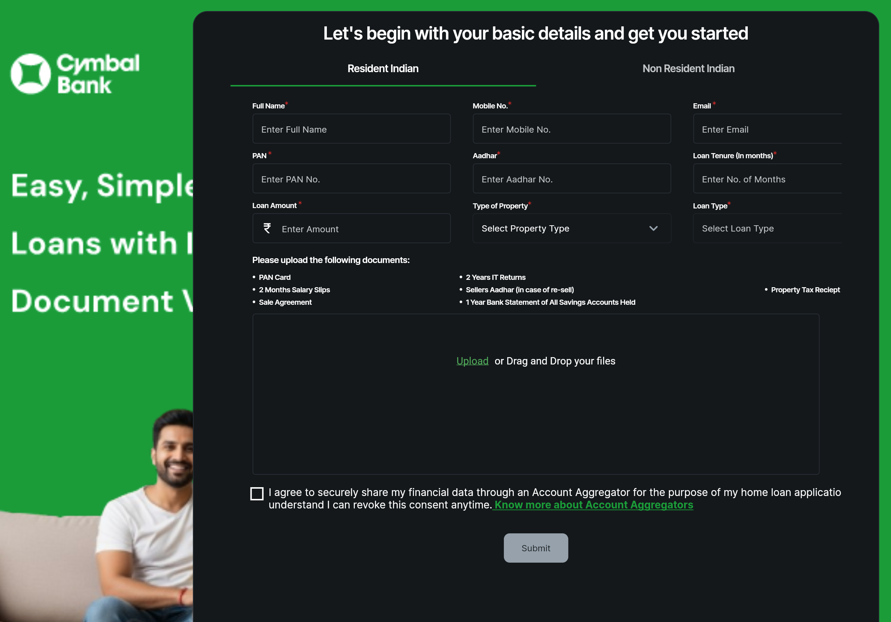

# Project Alchemy

Git repo for work done for Project Alchemy 2025.

Transforming Mortgage lending with AI Agents.

We've built a small app composed of a `frontend` and `backend`.

# Installation

To install cd into the `terraform` directory, and then:

    $ terraform apply -var="project_id=<your_project_id>" -var="region=<your_region>"

The installation will:

* Create a new Artifact Repository
* Build a container using `gcloud build` and push an image to the repository
* Deploy an S3 bucket for user uploads
* Deploy a cloud run instance based on the container image built

We use `local-exec` provisioner to build the image as part of the terraform apply, please ensure your project-id and region in your cli matches the destination project of `terraform apply`

# Usage

The output of the project will be a cloud url that host both the frontend and backend:

Use the sample documents in `backend/user_uploads`. The upload accepts multiple files, to avoid errors, upload all files in the directory.

# Run Locally

To run more locally, cd into the backend directory and run:

    $ uv venv
    $ source .venv/bin/activate
    $ uv sync --locked
    $ uv run uvicorn app:app --host 0.0.0.0 --port 8080

To test locally:

    $ source .venv/bin/activate
    $ python3 test_api.py --env local

# Deploy in Cloud run

Instructions on manual deployment to cloud run is in `backend/README.MD`

# Test on cloud run

The deployed container has a simpler 'pre-filled' UI for testing, at `/testui` , if you want to perform quick test on your deployed cloudrun instance you can use that instead.

